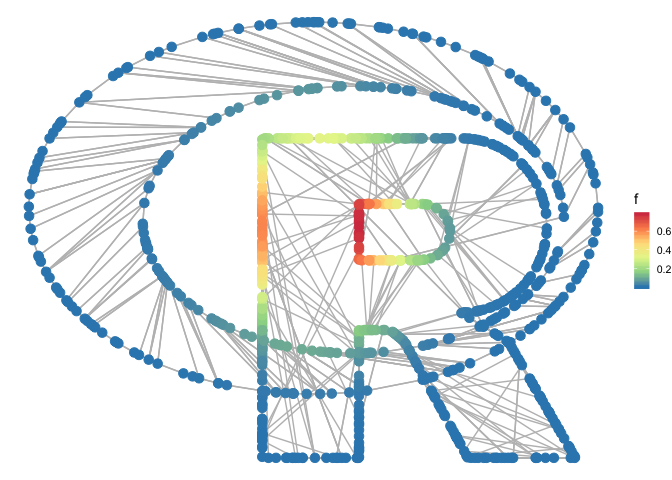
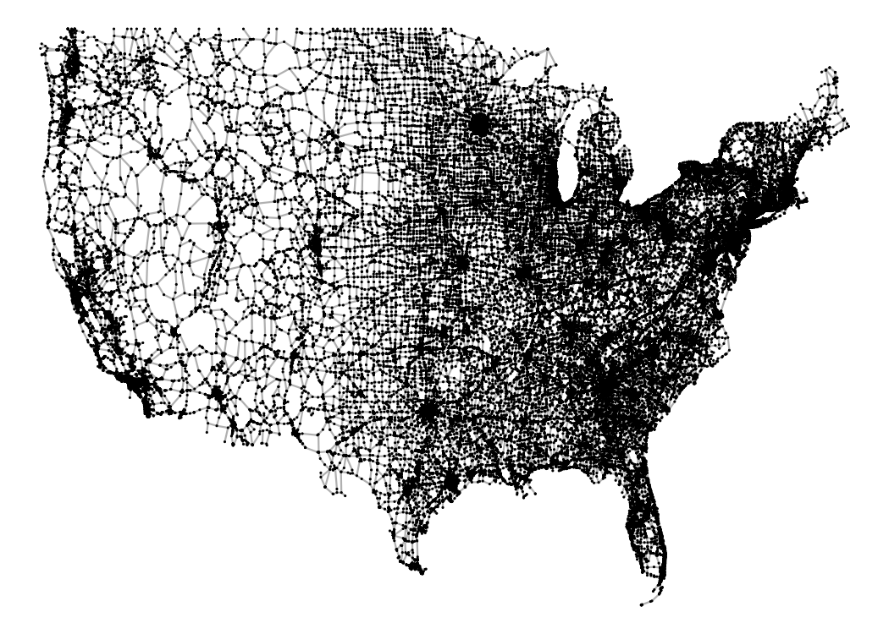
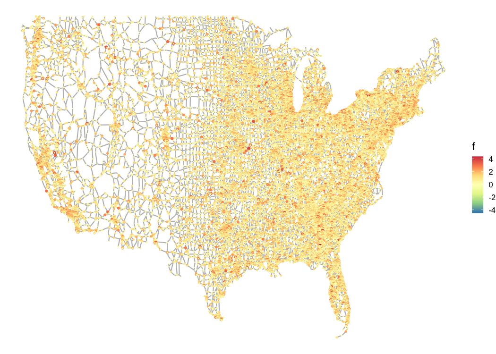
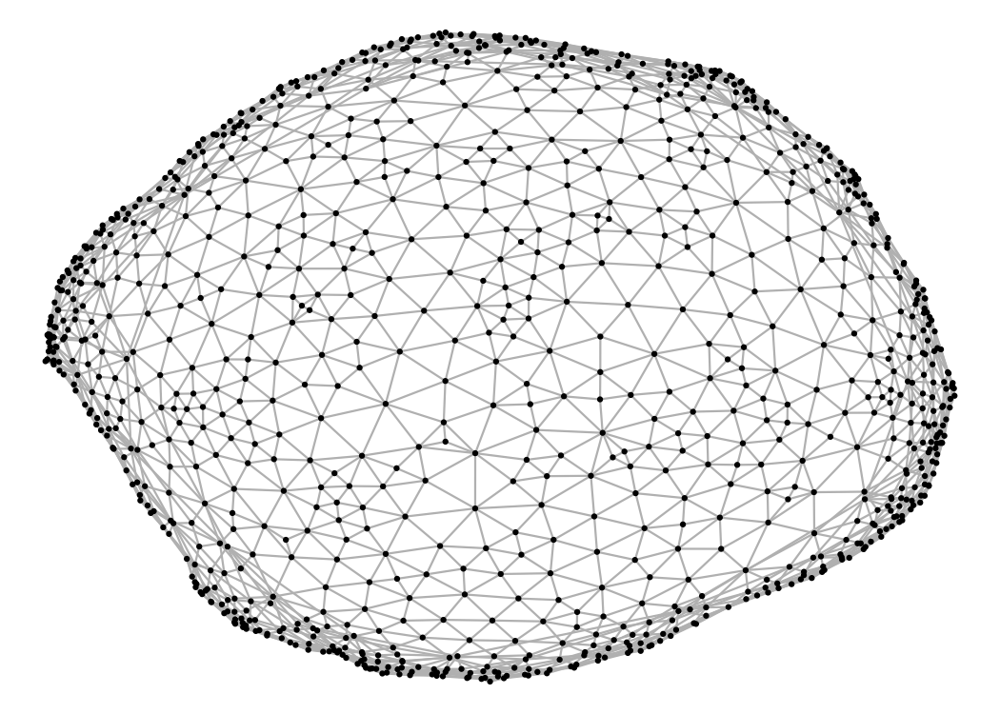
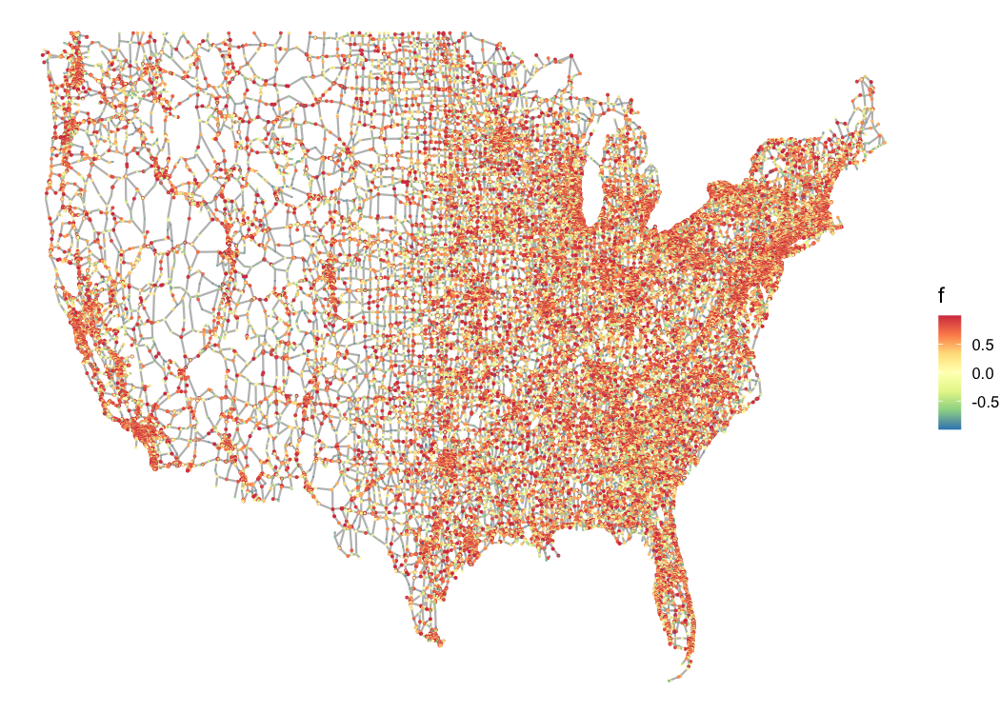

# gasper

[](http://cran.r-project.org/package=gasper)
 

Graph signal processing in R.


## Download and Install

Install the devtools package if you haven’t already.

``` r
install.packages("devtools")
```

To install the development package, type the following at the R command
line:

``` r
devtools::install_github("fabnavarro/gasper")
library(gasper)
```

To install the CRAN version of the package, type the following:

``` r
install.packages("gasper")
```

To obtain the complete list of package functions, simply type

``` r
help(package = "gasper")
```

## Getting Started

See the [package
vignette](https://fnavarro.perso.math.cnrs.fr/rpackage/gasper_vignette.pdf)
for more details. You could also build and see the vignette associated
with the package using the following lines of code

``` r
devtools::install_github("fabnavarro/gasper", build_vignettes = TRUE)
library(gasper)
```

Then, to view the vignette

``` r
vignette("gasper_vignette")
```

For an illustration of the features of the package, you can also refer
to the following repo
[SGWT-SURE](https://github.com/fabnavarro/SGWT-SURE) which provides an
effective generalization of the Stein Unbiased Risk Estimate (SURE) for
signal denoising/regression on graphs using Spectral Graph Wavelet
Transform.

## Interface to the SuiteSparse Matrix Collection

The package also provides an interface to the SuiteSparse Matrix
Collection, which is a large and actively growing set of sparse matrix
benchmarks gathered from a broad spectrum of applications (for details
see <https://sparse.tamu.edu/>).

The `download_graph` function allows to download a test matrix from this
collection. For example:

``` r
matrixname <- "usroads-48"
groupname <- "Gleich"
download_graph(matrixname,groupname)
attributes(`usroads-48`)
#> $names
#> [1] "sA"   "xy"   "dim"  "info"
```

`usroads-48` is composed of the sparse matrix `sA` (in compressed sparse
column format), coordinates `xy` (if present, in a data.frame), `dim`
the number of rows, columns and numerically nonzero elements and `info`
about the matrix (stored in a temporary folder as a plain text file)
that can be display via `file.show(usroads-48$info)` for example or in
the console:

``` r
cat(readLines(`usroads-48`$info), sep = "\n")
#> %%MatrixMarket matrix coordinate pattern symmetric
#> %-------------------------------------------------------------------------------
#> % UF Sparse Matrix Collection, Tim Davis
#> % http://www.cise.ufl.edu/research/sparse/matrices/Gleich/usroads-48
#> % name: Gleich/usroads-48
#> % [Continental US road network (with xy coordinates)]
#> % id: 2332
#> % date: 2010
#> % author: D. Gleich
#> % ed: T. Davis
#> % fields: name title A id date author ed kind aux
#> % aux: coord
#> % kind: undirected graph
#> %-------------------------------------------------------------------------------
#> 126146 126146 161950
```

It is also possible to plot a (planar) graph and plot signals defined on
top of it. For example :

``` r
f <- rnorm(nrow(`usroads-48`$xy))
plot_graph(`usroads-48`, size = 0.05)
plot_signal(`usroads-48`, f, size = f/4)
```



In cases where these coordinates are not supplied, `plot_graph` employs
simple spectral graph embedding to calculate some node coordinates
(nodes that are connected or share structural similarities in the graph
are placed close to each other in the spectral drawing). This is done
using the function `spectral_coords`, which computes the spectral
coordinates based on the eigenvectors associated with the smallest
non-zero eigenvalues of the graph’s Laplacian.

``` r
matrixname <- "delaunay_n10"
groupname <- "DIMACS10"
download_graph(matrixname,groupname)
attributes(delaunay_n10)
#> $names
#> [1] "sA"   "dim"  "info"
plot_graph(delaunay_n10)
plot_signal(delaunay_n10,
            cos(1:nrow(delaunay_n10$sA)))
```


