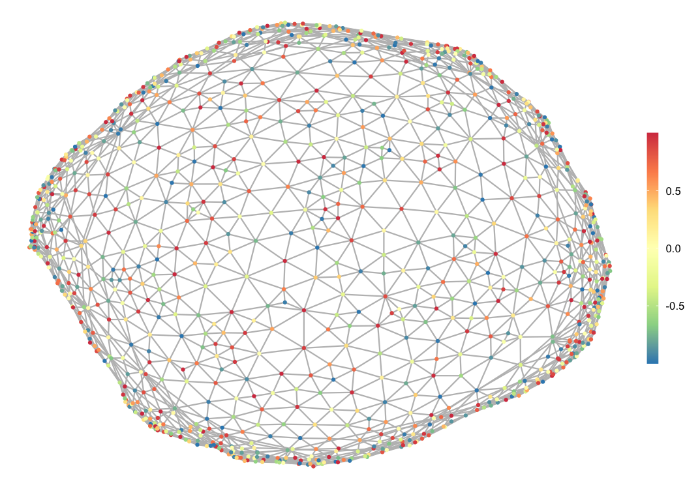

# gasper

[](https://cran.r-project.org/package=gasper)
 

Graph signal processing in R.


## Download and Install

Install the devtools package if you haven’t already.

``` r
install.packages("devtools")
```

To install the development package, type the following at the R command
line:

``` r
devtools::install_github("fabnavarro/gasper")
library(gasper)
```

To install the CRAN version of the package, type the following:

``` r
install.packages("gasper")
```

To obtain the complete list of package functions, simply type

``` r
help(package = "gasper")
```

## Getting Started

See the [package
vignette](https://fnavarro.perso.math.cnrs.fr/rpackage/gasper_vignette.pdf)
or
[documentation](https://fnavarro.perso.math.cnrs.fr/rpackage/gasper.pdf)
for more details. You could also build and see the vignette associated
with the package using the following lines of code

``` r
devtools::install_github("fabnavarro/gasper", build_vignettes = TRUE)
library(gasper)
```

Then, to view the vignette

``` r
vignette("gasper_vignette")
```

For an illustration of the features of the package, you can also refer
to the following repo
[SGWT-SURE](https://github.com/fabnavarro/SGWT-SURE) which provides an
effective generalization of the Stein Unbiased Risk Estimate (SURE) for
signal denoising/regression on graphs using Spectral Graph Wavelet
Transform.

## Interface to the SuiteSparse Matrix Collection

The package also provides an interface to the SuiteSparse Matrix
Collection, which is a large and actively growing set of sparse matrix
benchmarks gathered from a broad spectrum of applications (for details
see <https://sparse.tamu.edu/>).

Included in the package, the `SuiteSparseData` dataset contains data
from the SuiteSparse Matrix Collection. The structure of this dataframe
mirrors the structure presented on the SuiteSparse Matrix Collection
website, allowing users to query and explore the dataset directly within
R.

Here is a sample of the `SuiteSparseData` dataset, showing the first 15
rows of the table:

``` r
SuiteSparseData_subset <- head(SuiteSparseData, 15)
```

| ID  | Name     | Group | Rows | Cols | Nonzeros | Kind                  | Date |
|:----|:---------|:------|-----:|-----:|---------:|:----------------------|:-----|
| 1   | 1138_bus | HB    | 1138 | 1138 |     4054 | Power Network Problem | 1985 |
| 2   | 494_bus  | HB    |  494 |  494 |     1666 | Power Network Problem | 1985 |
| 3   | 662_bus  | HB    |  662 |  662 |     2474 | Power Network Problem | 1985 |
| 4   | 685_bus  | HB    |  685 |  685 |     3249 | Power Network Problem | 1985 |
| 5   | abb313   | HB    |  313 |  176 |     1557 | Least Squares Problem | 1974 |
| 6   | arc130   | HB    |  130 |  130 |     1037 | Materials Problem     | 1974 |
| 7   | ash219   | HB    |  219 |   85 |      438 | Least Squares Problem | 1974 |
| 8   | ash292   | HB    |  292 |  292 |     2208 | Least Squares Problem | 1974 |
| 9   | ash331   | HB    |  331 |  104 |      662 | Least Squares Problem | 1974 |
| 10  | ash608   | HB    |  608 |  188 |     1216 | Least Squares Problem | 1974 |
| 11  | ash85    | HB    |   85 |   85 |      523 | Least Squares Problem | 1974 |
| 12  | ash958   | HB    |  958 |  292 |     1916 | Least Squares Problem | 1974 |
| 13  | bcspwr01 | HB    |   39 |   39 |      131 | Power Network Problem | 1981 |
| 14  | bcspwr02 | HB    |   49 |   49 |      167 | Power Network Problem | 1981 |
| 15  | bcspwr03 | HB    |  118 |  118 |      476 | Power Network Problem | 1981 |

Here’s an example to retrieve all undirected weighted graphs with the
number of columns and rows between 50 and 150:

``` r
filtered_mat <- SuiteSparseData[SuiteSparseData$Kind == "Undirected Weighted Graph" & 
                                SuiteSparseData$Rows >= 50 & SuiteSparseData$Rows <= 150 &
                                SuiteSparseData$Cols >= 50 & SuiteSparseData$Cols <= 150, ]
```

|      | ID   | Name              | Group    | Rows | Cols | Nonzeros | Kind                      | Date |
|:-----|:-----|:------------------|:---------|-----:|-----:|---------:|:--------------------------|:-----|
| 1506 | 1506 | Journals          | Pajek    |  124 |  124 |    12068 | Undirected Weighted Graph | 2000 |
| 1519 | 1519 | Sandi_authors     | Pajek    |   86 |   86 |      248 | Undirected Weighted Graph | 1999 |
| 2400 | 2400 | lesmis            | Newman   |   77 |   77 |      508 | Undirected Weighted Graph | 1993 |
| 2858 | 2858 | breasttissue_10NN | ML_Graph |  106 |  106 |     1412 | Undirected Weighted Graph | 2020 |
| 2872 | 2872 | iris_dataset_30NN | ML_Graph |  150 |  150 |     5518 | Undirected Weighted Graph | 2020 |

The `download_graph` function allows to download a test matrix from this
collection. For example:

``` r
matrixname <- "usroads-48"
groupname <- "Gleich"
download_graph(matrixname,groupname)
attributes(`usroads-48`)
#> $names
#> [1] "sA"   "xy"   "dim"  "temp"
```

`usroads-48` is composed of the sparse matrix `sA` (in compressed sparse
column format), coordinates `xy` (if present, in a data.frame), `dim`
the number of rows, columns and numerically nonzero elements and `temp`
path to the temporary directory where the matrix and downloaded files
(including singular values if requested) are stored. Information about
the matrix can be display via
`file.show(paste(`usroads-48`$temp,"usroads-48",sep=""))` or in the
console:

``` r
cat(readLines(paste(`usroads-48`$temp,"usroads-48",sep="")), sep = "\n")
#> %%MatrixMarket matrix coordinate pattern symmetric
#> %-------------------------------------------------------------------------------
#> % UF Sparse Matrix Collection, Tim Davis
#> % http://www.cise.ufl.edu/research/sparse/matrices/Gleich/usroads-48
#> % name: Gleich/usroads-48
#> % [Continental US road network (with xy coordinates)]
#> % id: 2332
#> % date: 2010
#> % author: D. Gleich
#> % ed: T. Davis
#> % fields: name title A id date author ed kind aux
#> % aux: coord
#> % kind: undirected graph
#> %-------------------------------------------------------------------------------
#> 126146 126146 161950
```

`download_graph` function has an optional svd argument; setting “svd =
TRUE” downloads a “.mat” file containing the singular values of the
matrix, if available. To access the temporary folder use, for example,

``` r
list.files(`usroads-48`$temp)
#> [1] "usroads-48"           "usroads-48_coord.mtx" "usroads-48.mtx"
```

In addition, the `get_graph_info` function allows to retrieve detailed
information about the matrix from the SuiteSparse Matrix Collection
website (`rvest` package needs to be installed to use it). This function
extracts and formats various properties and metadata associated with the
matrix (i.e., it fetches the two to three tables with
“MatrixInformation,” “MatrixProperties” and, if available,
“SVDStatistics”), providing a convenient way to access this overview of
the graph directly within R. Here is how you can use it:

``` r
graph_info <- get_graph_info(matrixname, groupname)
graph_info
```

<table class="kable_wrapper">
<tbody>
<tr>
<td>

|                 | MatrixInformation |
|:----------------|:------------------|
| Name            | usroads-48        |
| Group           | Gleich            |
| Matrix ID       | 2332              |
| Num Rows        | 126,146           |
| Num Cols        | 126,146           |
| Nonzeros        | 323,900           |
| Pattern Entries | 323,900           |
| Kind            | Undirected Graph  |
| Symmetric       | Yes               |
| Date            | 2010              |
| Author          | D. Gleich         |
| Editor          | T. Davis          |

</td>
<td>

|                             | MatrixProperties |
|:----------------------------|:-----------------|
| Structural Rank             |                  |
| Structural Rank Full        |                  |
| Num Dmperm Blocks           |                  |
| Strongly Connect Components | 1                |
| Num Explicit Zeros          | 0                |
| Pattern Symmetry            | 100%             |
| Numeric Symmetry            | 100%             |
| Cholesky Candidate          | no               |
| Positive Definite           | no               |
| Type                        | binary           |

</td>
</tr>
</tbody>
</table>

The `download_graph` function has an optional argument `add_info` which,
when set to `TRUE`, automatically calls `get_graph_info` and appends the
retrieved information to the output of `download_graph`. This makes it
easy to get both the graph data and its associated information in a
single function call.

``` r
downloaded_graph <- download_graph(matrixname, groupname, add_info = TRUE)
downloaded_graph$info
```

It is also possible to plot a (planar) graph and plot signals defined on
top of it. For example:

``` r
f <- sin(rnorm(nrow(`usroads-48`$xy)))
plot_graph(`usroads-48`, size = 0.05)
plot_signal(`usroads-48`, f, size = f/4)
```


In cases where these coordinates are not supplied, `plot_graph` employs
simple spectral graph embedding to calculate some node coordinates
(nodes that are connected or share structural similarities in the graph
are placed close to each other in the spectral drawing). This is done
using the function `spectral_coords`, which computes the spectral
coordinates based on the eigenvectors associated with the smallest
non-zero eigenvalues of the graph’s Laplacian.

``` r
matrixname <- "delaunay_n10"
groupname <- "DIMACS10"
download_graph(matrixname,groupname)
attributes(delaunay_n10)
#> $names
#> [1] "sA"   "dim"  "temp"
plot_graph(delaunay_n10)
plot_signal(delaunay_n10,
            cos(1:nrow(delaunay_n10$sA)))
```



``` r
graph_info <- get_graph_info(matrixname, groupname)
graph_info
```

<table class="kable_wrapper">
<tbody>
<tr>
<td>

|                             | SVDStatistics |
|:----------------------------|:--------------|
| Structural Rank             |               |
| Structural Rank Full        |               |
| Num Dmperm Blocks           |               |
| Strongly Connect Components | 1             |
| Num Explicit Zeros          | 0             |
| Pattern Symmetry            | 100%          |
| Numeric Symmetry            | 100%          |
| Cholesky Candidate          | no            |
| Positive Definite           | no            |
| Type                        | binary        |

</td>
<td>

|                        | SVD Statistics |
|:-----------------------|:---------------|
| Matrix Norm            | 6.293702e+00   |
| Minimum Singular Value | 1.875512e-03   |
| Condition Number       | 3.355724e+03   |
| Rank                   | 1,024          |
| sprank(A)-rank(A)      |                |
| Null Space Dimension   | 0              |
| Full Numerical Rank?   | yes            |

</td>
</tr>
</tbody>
</table>
